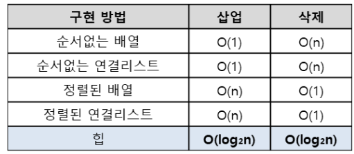
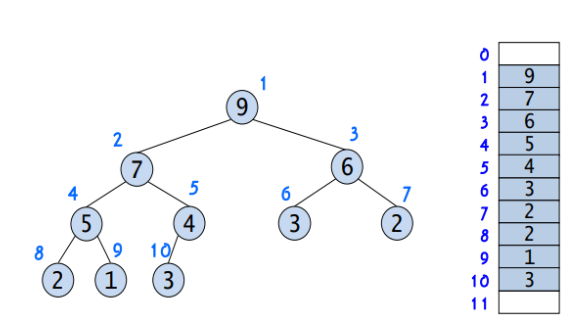

## 03-5. 스택과 큐

### 스택(Stack) 
➡️ 후입선출(LIFO)
- ```리스트``` 활용하여 구현 

✏️ 위치
- ```top``` : 삽입&삭제가 일어나는 위치

✏️연산
- ```s.append(data)``` : top 위치에 새로운 데이터를 삽입
- ```s.pop()```: top 위치에 현재 있는 데이터를 삭제하고 확인하는 연산
- ```s[-1]``` : top 위치에 현재 있는 데이터를 단순 확인하는 연산 

✏️ex
- 브라우저의 뒤로가기
- 실행 취소(Ctrl+z)
- 재귀 함수
- 역순 문자열(문자열 거꾸로 뒤집기)

✏️시간 복잡도
- 삽입, 삭제 : ```O(1)```
- 탐색 : ```O(n)```
<br/><br/>

### 큐(Queue)
➡️ 선입선출(FIFO)

✏️ 위치
- ```rear``` : 큐에서 ```가장 끝 데이터```를 가리키는 영역
- ```front``` : 큐에서 ```가장 앞 데이터```를 가리키는 영역 

✏️ 연산
- ```s.append(data)```:rear 부분에서 새로운 데이터 삽입
- ```s.popleft()```:front 부분 데이터 삭제,확인
- ```s[0]```: 큐의 맨 앞(front)에 있는 데이터를 확인할 때 사용 

✏️ ex
- BFS 알고리즘
- 프린터 대기열 

✏️시간 복잡도
- 삽입, 삭제 : ```O(1)```
- 탐색 : ```O(n)```
---
### 1874 : 스택으로 수열 만들기
✏️ 수열이 주어지면 스택을 이용해서 해당 수열을 만들어야
이떄, 주의해야 할 점 !! push연산, pop연산 외에 수열을 만들 수 없는 불가능한 경우가 언제인지를 생각해야 함. 

😡 나는 직접 올림차순 배열을 따로 만들어서 여기서 인덱스를 하나씩 늘어나도록 하여 주어진 수열의 값과 비교하는 방식을 사용하려고 시도함.
하지만 책에서는 별도의 오름차순 배열을 만들지 않고 num=1로 숫자로 설정하여 이를 하나씩 늘여가면서 수열의 값과 비교하는 방식 채택. 
하지만 이 경우에는 만약 입력된 수열의 크기가 8인데, 1~8이 입력되지 않고 1,2,3,4,6,7,8,9 이런 식으로 입력되면 달라지지 않나? 

바보야!! num 숫자 자체와 비교하는게 아니고 num을 하나씩 크게 해서 기존 수열과 비교해 조건에 만족하는 애들만 stack에 저장하는 거였잖슴~
∴ num과 stack 중 비교를 어떻게 하는지와 for, while문을 적절히 사용해야 하는 부분을 주의해야 함
---
### 17298 : 오큰 수 구하기
✏️ **스택 활용**
인덱스를 활용해야 하는 것이 가장 큰 중요한 점이다. 
```pop``` : 해당 인덱스의 오큰수가 stack의 top을 만족할 때
```append``` : 수열의 다음 인덱스를 보려고 할 때 (만약 해당 인덱스의 오큰수가 없다면 해당 인덱스는 스택에 계속 남아있게 됨 -> 마지막까지 스택에 남아있는 인덱스들은 오큰수가 존재하지 않고 -1이 됨)

⭐ 스택에 인덱스로 저장하니 오큰수 배열에 어떤 걸 저장해야 할지 헷갈렸다. 이렇게 생각하면 간단하다!
pop 당시 stack[top] 인덱스가 가지는 값이 바로 오큰수이다.
---
### 2164 : 카드 게임
⭐ **큐(queue)의 구현**
- 리스트 형태로는 구현 ✖️
  ( ∵ 리스트는 삽입/삭제가 한 곳에서만 가능 -> 큐의 특성 상 양방향에서 삽입/삭제가 일어나야 하는데, 리스트에서 구현하려면 삭제 시 다른 원소들을 모두 한 칸씩 이동시켜야 하기 때문에 느림)

1. ```collections.deque```
: double linked list 사용 -> 양방향에서 데이터 처리 가능

```python
  from collections import deque
  dq=deque([])

  dq.append(1)
  dq.append(2)
  dq.append(3)
  dq.append(4)
  #dq=([1,2,3,4])

  print(dq.popleft()) #da=([2,3,4])
```

2. ```Queue 모듈``` 
: Queue, PriorityQueue, LifoQueue(스택) 까지 총 세 종류 존재 


```python
  import queue
  q=queue.Queue()

  q.put() #append와 동일
  q.get() #popleft와 동일
```

✏️ 
1. 큐 활용 -> 카드 쌓기
2. 맨 위(front) 삭제
3. 맨 위(front) 삭제 -> append 
4. 이 과정 반복 
---

### 11286 : 절댓값 힙 구현하기
⭐ **우선순위 큐** : 우선순위가 높은 데이터가 먼저 나가는 형태의 자료구조 
  -> 일반적으로 **힙(Heap)**을 이용하여 구현 
  - **구현방법에 따른 시간복잡도 비교**
    
  > **연산**<br/>
   ```insert(x)``` : 우선순위 큐에 요소 x 추가<br/>
  ```remove()``` : 우선순위 큐에서 가장 우선순위가 높은 요소를 삭제하고 반환<br/>
  ```find()``` : 우선순위 큐에서 가장 우선순위가 높은 요소 반환 
  
<br/>
⭐ **우선순위 큐 구현**
  ➡️ 힙은 일반적으로 **배열을 이용하여 구현** (완전이진트리이므로 중간에 비어있는 요소가 없기 때문)
  
  - 트리의 각 노드에 번호를 붙이고 이 번호를 배열의 인덱스로 
  - 배열로 구현했기 때문에 부모 or 자식 노드를 찾아가는 연산을 구현하기도 간편 

⭐ **삽입 연산**
1. 완전이진트리의 마지막 노드에 이어서 새로운 노드 추가
2. 추가된 새로운 노드를 부모의 노드와 비교하여 교환 
3. 정상적인 힙트리가 될 때까지(더이상 부모노드와 교환할 필요가 없을 때까지) 2번 반복 
➡️ 최악의 경우 새로 추가된 노드가 루트노드까지 비교하며 올라가므로 ```O(log_2n)```

⭐ **삭제 연산** : 힙 트리에서 루트노드가 가장 우선순위가 높음 -> **루트노드 삭제해야**
1. 루트 노드 삭제
2. 루트 노드가 삭제된 빈자리에 완전이진트리의 마지막 노드를 가져옴
3. 루트 자리에 위치한 새로운 노드를 자식 노드와 비교하여 교환
   (최대 힙:자식노드 중 더 큰 값과 교환, 최소 힙: 더 작은 값과 교환)
4. 정상적인 힙트리가 될 때까지(더 이상 자식노드와 교환할 필요가 없을 때까지) 반복
➡️ 최악의 경우 루트노드부터 가장 아래까지 비교하며 올라가므로 ```O(log_2n)```


⭐ **힙(Heap)** : 우선순위 큐를 위해 고안된 **완전이진트리** 형태의 자료구조
  - 여러 개의 값 중 최댓값/최솟값을 찾아내는 연산이 빠름 
  - 힙의 특징 : 완전이진트리 형태 / 이진탐색트리와 달리 중복된 값이 허용됨 
  - 힙의 종류 : 최대 힙, 최소 힙

⭐ **파이썬에서의 구현 방법**
1. ```from queue import PriorityQueue``` : ```queue``` 내장 모듈에서 제공<br/>
- ```myQueue=PriorityQueue(maxsize=8)``` : 우선순위 큐의 디폴트 사이즈는 무한대, 만약 특정 최대 크기를 가진 우선순위 큐가 필요하다면 maxsize 제시<br/>
- ```que.put(1)``` : 우선순위 큐에 원소 추가<br/>
- ```que.get()``` : 우선순위 큐에서 원소 삭제 <br/>
- 정렬 기준 변경 : ```(우선순위,값)``` 튜플 형태로 데이터 추가, 제거
  ```python
    que.put((3,'Apple'))
    que.put((1,'Banana'))
    que.put((2,'Cherry'))

    print(que.get()[1]) #Banana
    print(que.get()[1]) #Cherry
    print(que.get()[1]) #Apple
  ```

<br/><br/>

✏️데이터가 새로 삽입될 때마다 절댓값과 관련된 정렬이 필요하므로 "우선순위 큐" 사용 
  -> 절댓값 정렬이 필요하므로 우선순위 큐의 정렬 기준을 직접 정의해야 함 
1. ```x=0``` 일 때 : 큐가 비어 있을 때는 0 출력, 비어있지 않을 때는 절댓값이 최소인 값을 출력. 
단, 절댓값이 같다면 음수를 우선하여 출력
2. ```x=1``` 일 때 : put으로 큐에 새로운 값을 추가, 우선순위 큐 정렬 기준으로 자동 정렬 

❓ **절댓값 기준 정렬**을 어떻게 해야 할까.. 
  => 절댓값함수 ```abs(x)```