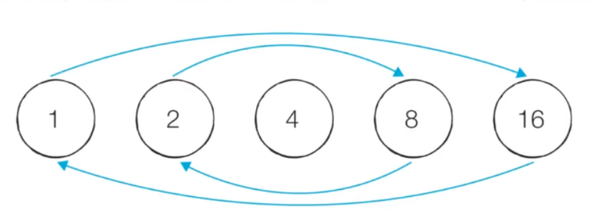

## 깊이 우선 탐색
= 그래프 완전 탐색 기법 중 하나
> 그래프의 시작 노드에서 출발 ➡️ 탐색할 한 쪽 분기를 정하여 최대 깊이까지 탐색 ➡️ 다른 쪽 분기로 이동 ➡️ 다시 탐색 수행

- **재귀 함수**로 표현 ‼️```스택 오버플로우```주의
- **스택 자료구조** 사용
- 시간 복잡도 : ```O(V+E)```(V:노드 수, E:에지 수)

### 깊이 우선 탐색 핵심 이론
✅ 한 번 방문한 노드를 다시 방문하면 안 됨 -> 노드 방문 여부를 체크할 리스트가 필요 ‼️
<br/>
<br/>

**1. DFS를 시작할 노드를 정한 후 사용할 자료구조 초기화하기**
- DFS를 시작하기 위해 필요한 초기작업 : ```인접 리스트로 그래프 표현하기```, ```방문 리스트 초기화하기```,```시작 노드 스택에 삽입하기```


**2. 스택에서 노드를 꺼낸 후 꺼낸 노드의 인접 노드를 다시 스택에 삽입하기**
- 꺼낸 노드를 탐색 순서에 기입 
- 인접 리스트의 인접 노드를 스택에 삽입
- 방문 리스트를 체크

** 3. 스택 자료구조에 값이 없을 때까지 반복하기**

⭐ 스택에 노드를 **삽입**할 때 : ```방문 리스트```체크 <br/>
⭐ 스택에서 노드를 **뺄** 때 : ```탐색 순서```에 기록 

<br/><br/>
### 11724 : 연결 요소의 개수 구하기
✏️ **연결 요소** = 에지로 연결된 노드의 집합 
➡️ 한 번의 DFS가 끝날 때까지 탐색한 모든 노드의 집합을 하나의 연결 요소로 판단할 수 O

> ```sys.setrecursionlimit(1000)``` : 파이썬에서 재귀 호출의 최대 깊이를 1000으로 설정. 
무한 재귀로 인한 스택 오버플로우를 방지하기 위해
<br/>- 재귀 깊이를 너무 높게 설정 -> 메모리 부족 or 파이썬 인터프리터 충돌이 발생할 수 O

∴ 모든 노드를 탐색하는 데 실행한 DFS의 실행횟수 = 연결 요소의 개수

<br/><br/>
### 2023 : 신기한 소수 찾기
- **소수 판별 방법**
1. 에라토스테네스의 체
   - 시간복잡도 : ```O(Nlog(logN))``` 
   > **자연수 N까지의 소수를 판별해보자**
   > 1. i를 제외한 i의 배수를 소수에서 제외시킴
   > 2. i에 1을 더함 
```python
import math

N=120
is_prime=[True]*(N+1) #처음에는 모두 true로 초기화
is_prime[1]=True

#에라토스테네스의 체 알고리즘
for i in range(2,int(math.sqrt(N))+1):
    if not is_prime[i]:continue #i가 소수면 그 배수들은 소수가 아니므로 False처리
    for j in range(2*i,N+1,i): #j=2*i부터 N까지 i씩 증가시키며 is_prime[j]=False
        is_prime[j]=False

for i in range(1,N+1): #결과 출력
    print(i,is_prime[i])
```
> **⁉️ 왜 i의 범위를 제곱근까지만 설정하는 걸까** <br/>
‼️ 모든 약수가 가운데 약수를 기준으로 곱셈 연산에 대해 대칭을 이룸
(ex.) 16의 약수는 1,2,4,8,16이다. 이때, 2*8=16, 8*2=16으로 대칭이다.<br/>
➡️ 따라서 특정한 자연수의 모든 약수를 찾을 때 가운데 약수(제곱근)까지만 확인하면 됨
(16이 2로 나누어떨어진다는 것=8로도 나누어떨어진다는 것)


<br/><br/>

### 13023:친구 관계 파악하기
✏️ ```A-B-C-D-E``` 이런 그래프인지 파악하려면, 모든 노드에 대해 DFS를 실행 ➡️ 재귀의 깊이가 5이상 (5개의 노드가 재귀 형태로 연결) 되어야 한다
                                                                             